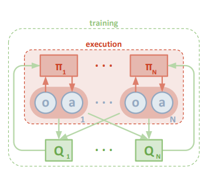
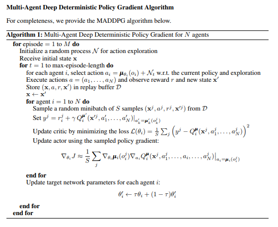
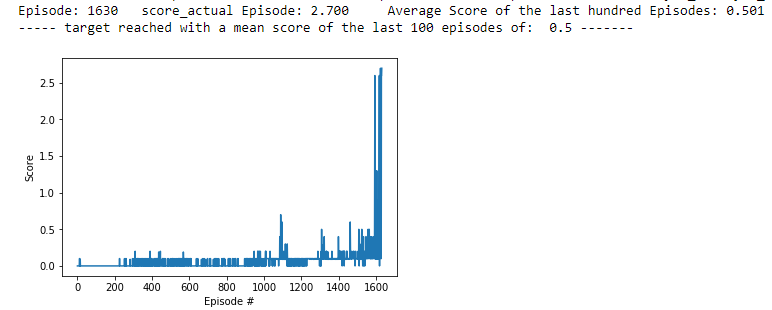
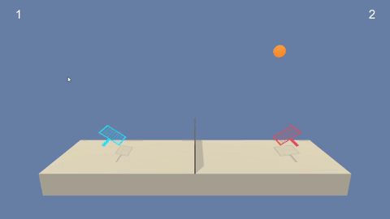
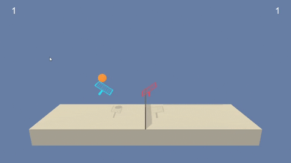
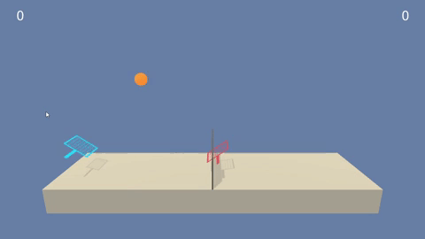

##### Implemented algorithm: "MADDPG" (Multi Agent Deep Deterministic Policy Gradient")

Multi-Agent RL-systems are able to solve tasks together.
The given Tennis-Environment has both continous state space and continous
action space. To solve tasks in such an environment, we need a kind of actor-critic methode.
It is important to find an appropriate algorithm and reward-structure
that the individual agents can solve the given problem together at best.
The range of behaviour of such agents can be from high cooperation and little competition to
little cooperation and high competition.

In "real multi-agent systems" an agent has not simply information about the
environment but there is also supplemental information about all other agents.
This supplement information is necessary to create a cooperative behaviour.
Such RL-systems are difficult to solve.
The reason is, that each agent develops his own policy, wich is constantly 
changing during training-time.
A result of this individual policy development is, that the environment becomes "non-stationary".
This means, that one agent has difficulties to understand the others behaviour for generating
his "cooperative" predictions.

One new and sucessful algorithm (from 2018) is the 
"Multi-Agent-Actor-Critic for Mixed Cooperative-Competitive Environments" 
algorithm, in short MADDPG.
As recommended in the Udacity-Course, I implemented my solution by following the MAADDG-Algorithm according to the 
arxiv-science-paper [1706.02275](https://arxiv.org/pdf/1706.02275.pdf)

MADDP is an extension of the Actor-Critic-Policy-Gradient methode (DDPG).
Therefore I took  the DDPG-Algorithm of the Udacity Dddpg-Pendulum-Project as a programming basis.

#### Functionality of the MADDPG-Algorithm
* MADDPG during the execution-time:  
The learned policies can only use local environmental information.
There is no particular structure for a direct information-exchange between agents during execution time.

* MADDPG during training-time: 
There are two main points of the algorithm, which make it possible that agents take in consideration 
the behaviour of the other agents: 
    * **First:** The Critic-Network of each agent receives information about the actions of the other agents.
    During training-time, the Critic-Network (of first agent) gets additionally to
    the state-information (of first agent) also gets the actions of the other agents as an input.
    The critic (of first agent) themselves takes this information to compute the q-value, which helps to
    optimize the actors (of first agent) prediction.
    * **Second:** Alle agents use the same Replay-Buffer
All agents collect their experience-data in the same replay-buffer.
Therefore each agent taks advantage of the experience of all of the other agents.

With this structure, the actors policies are also shaped/developped with information about the other
agents. 
This is a framework of a centralized training and decentralized execution.
Therefore the agents can be executed without the critics during execution time.
In my tennis-play-notebook we can see, that only the weights of the actors are loaded.
The non-stationary-problem can be avoided with this algorithm.

#### Visual depiction of the MADDPG-Algorithm (taken from mentioned paper "1706.02275.pdf")
In the following two pictures you can see first an overview over the MADDPG-process
and second the MADDP pseudocode.

##### MADDPG --> functional picture
Description of this overview:
* Pi_1 = Policy of  agent_1
* Pi_2 = Policy of agent_2
* a = actions generated from the agents policy and executed in the environment
* O = output of the environment, which is sent to the actors-Network and the critic-Network
* Q_1, Q_2 are the Q-Values generated from the Critic-Networks.
These generated information are used to update the network-parameters.

##### MADDPG --> pseudocode

#### Neural Network Architecture
I tested the system with differend quantities for the hidden-layer nodes.
Surprisingly for me was, that this did not remarcable influence the score-result.
Therefore I used  small note-numbers to have better computaional performance during training-time.

##### The Actor 

* Input-Layer with 24 (state size) 
* First hidden Layers  with the 64 nodes (input 24 nodes of the state-space) and Relu-Activation Function
* Second hidden Layer with 32 nodes input (input 64 nodes) and Relu-Activation Function
* Output Layer 2 nodes for continuous output values-Vector and tangh Activation Function

##### Critic Network
* Input-Layer with 24 (state-size) + 2*2 (action size)
* First hidden Layers  with the 64 nodes and Relu-Activation Function
* Second hidden Layer with 32 nodes and Relu-Activation Function
* Third hidden Layer with 16 nodes and Relu-Activation Function
* Output Layer with 1  node for the Q-value

##### Code adaptation
The main points of the Code adaptation were:
* Creating two agent-objects
* Extract the environment information of each agent 
* Feed this data to the agent-objects (actor.- and critic Network), whereby
the critic-network resceives the action-information of the other agent.
These needed some changes in the method.py-Module.
* Create a **unique** Replay-Buffer
* Create a program to make run the tennis-players.

##### Hyperparameter-definition/finding
The adaptation of the following Parameters leaded to stable net-learning:
* BUFFER_SIZE   = 1e7, replay buffer size
* BATCH_SIZE    = 128, minibatch size
* WEIGHT_DECAY   = 0, L2 weight decay
* LR_ACTOR =    1e-4, learning rate of the actor 
* LR_ACTOR =    1e-3, learning rate of the critic 
* GAMMA = 0.99, discount factor
* TAU = 1e-3, for soft update of target parameters
* NUM_UPDATES = 6, proceed the learning procedure each time NUM_UPDATES-times
* add_noise = False, noise-functionality

**observations/experiences during hyperparameter-search: **  
The best influence for training the Network had 
the NUM_UPDATES-Parameter.

I switched off to add noise to the actions, because this noise decreased
the convergence behaviour of the system

#### Training result
The expected score-result of 0.5 is shown in the picture below: 

#### The Tennis_Player.ipynb

I created also the python Notebook "Tennis_Player.ipynb".
With this notebook, it is possible to load different weight-sets in the
actor-networks.These weight sets were created with different score results.
This tool make it possible to study the change of behaviour, depending of
the learning process. I added three examples as gif-plays

#### Further results
Below I added  3 different learning-levels of the Tennis-Players    

**Training level 1:** (poor player)  
The actor of player one is trained with a score-target of 0.1  
The actor of player two is trained with a score-target of 0.1  
  

**Training level 2:** (medium player with mixed levels)  
The actor of player one is trained with a score-target of 0.1  
The actor of player two is trained with a score-target of 0.3  
  
 

**Training level 3:** (best players) 
The actor of player one is trained with a score-target of 0.5  
The actor of player two is trained with a score-target of 0.5 

 
 

#### Improvements
- Optimization of Hyperparameters
The finding of a working parameter-set was hard and time-consuming.
So I had a look for other optimizations-possibilities.
I learnd that beside of random-search and grid-search there is also 
a bayesian optimization. 
This method uses a surrogate-function of 
the objective function to find optimized parameters

- Further MADDPG/Adaptations/other Algorithms
I think the given MADDPG can be used for further studies and different tasks.
There are a lot of possibilities to change the code to make it usable for 
different challenges.
Experimenting with different reward-functions, depending on the given task,
can also lead to better results.

It would also be intersting to analyze, if it is possible to solve the Problem with 
some adaptations of the Proximal Policy Optimization-Algorithm.

